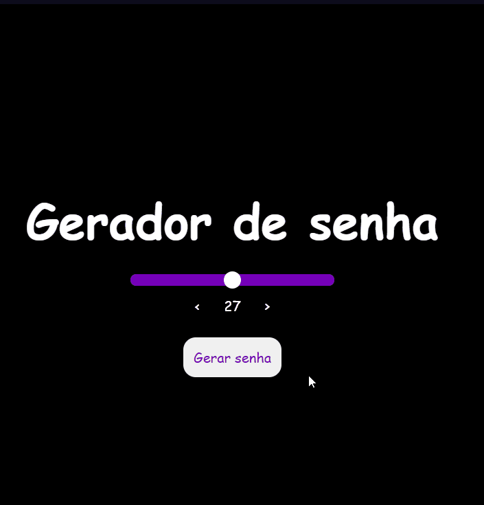

# Gerador de senha

# Sobre o projeto

<a href="https://passgnrtr.netlify.app" target="_blank">https://passgnrtr.netlify.app</a>

Projeto feita como um exercício para treinar minha lógica utilizando JS.

O projeto consiste em gerar uma senha aleatória com a quantidade de caracteres escolhida pelo usuário.

## Imagem do projeto 

# Tecnologias utilizadas
- HTML
- CSS
- JS

# Implementação 

Projeto implementado no Netlify.

# Autor

Diego Cruz's

<a href="https://www.linkedin.com/in/diegoscruz/">https://www.linkedin.com/in/diegoscruz/</a>